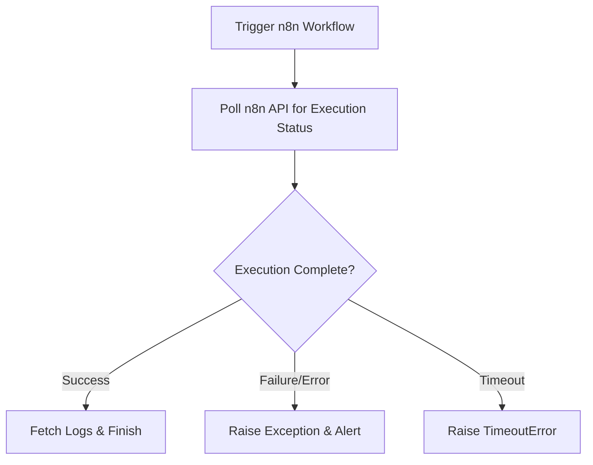

# n8n ETL with Monitoring DAG

This Airflow DAG triggers an **n8n workflow** via webhook, monitors its execution, and fetches logs. It is designed for **ETL pipelines** that require **automation, error handling, and monitoring** of n8n workflows.

---

## Table of Contents
- [Overview](#overview)
- [Features](#features)
- [Requirements](#requirements)
- [Setup](#setup)
- [Configuration](#configuration)
- [DAG Flow](#dag-flow)
- [Tasks](#tasks)
- [Usage](#usage)

---

## Overview
The DAG `n8n_etl_with_monitoring` performs the following steps:

1. Triggers a specified n8n workflow via a webhook.
2. Polls the n8n API to monitor workflow execution status.
3. Fetches logs for all executed nodes.
4. Raises exceptions if the workflow fails or times out.

This DAG is intended for Airflow 3.x and integrates with n8n via its webhook and API.

---

## Features
- Trigger n8n workflows programmatically.
- Monitor workflow execution with polling and timeout.
- Fetch node-level logs for debugging.
- Raise errors on workflow failures for automated alerting.
- Configurable poll interval and timeout.

---

## Requirements
- Python 3.12+
- Airflow 3.x
- `requests` library
- An Airflow **Connection** for n8n:
  - Connection ID: `n8n_local`
  - Host: `http://<n8n-host>:5678`
  - Password: `n8n_api_<your_api_key>`
- n8n workflow ID and webhook path

---

## Setup

1. Place the `n8n_dag.py` file into your Airflow `dags/` folder.
2. Ensure `requests` library is installed:

```bash
pip install requests
````

3. Create an Airflow connection `n8n_local` with your n8n host and API key.
4. Configure the workflow ID and webhook path inside the DAG:

```python
WORKFLOW_ID = "<YOUR_WORKFLOW_ID>"
WEBHOOK_PATH = "<YOUR_WEBHOOK_PATH>"
```

---

## Configuration

* **poll_interval**: Time (seconds) between API polling requests (default: 5s).
* **timeout**: Maximum time (seconds) to wait for workflow completion (default: 300s).
* **file_name**: Name of the file to send to the workflow (default: `input.csv`).
* **environment**: Target environment for the workflow (default: `dev`).

---

## DAG Flow



---

## Tasks

### 1. `trigger_n8n`

* Sends a GET request to the n8n webhook.
* Parameters:

  * `file_name`: Input file.
  * `environment`: Target environment.
* Returns `True` if the webhook was triggered successfully.

### 2. `monitor_n8n`

* Polls the n8n API for the latest workflow execution.
* Fetches node logs and prints them.
* Raises an exception if the workflow fails.
* Parameters:

  * `poll_interval` (default: 5s)
  * `timeout` (default: 300s)

---

## Usage

* Trigger the DAG manually from Airflow UI.
* Ensure your n8n workflow is active and the webhook is configured.
* Monitor logs in Airflow to track workflow execution and node-level outputs.

---

